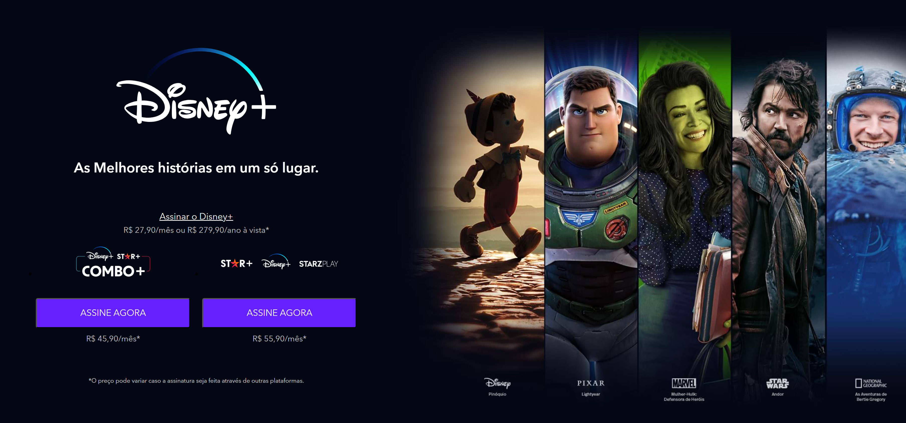

https://tarefa-21-disney-plus-clone-o9ldw0r0k.vercel.app/

**Disney Plus Clone**
=====================
 

Um clone do site da Disney+ feito com Gulp e Sass.

**Tecnologias Utilizadas**
-------------------------

* Frontend: HTML5, CSS3, SASS
* Backend: Nenhum (apenas um clon do site existente)
* Frameworks e Bibliotecas:
	+ Gulp para automação de tarefas
	+ Sass para pre-processamento de CSS

**Funcionalidades**
-----------------

* Clon do layout e design do site da Disney+
* Funcionalidade de assinatura com prazos e planos variados
* Lista de shows e filmes com imagens e descrições
* Suporte a diferentes dispositivos (computador, TV, celular, tablet)

**Instalação e Uso**
---------------------

1. Clone o repositório: `git clone https://github.com/[rodrigobergenthal]/Tarefa-21---Disney-Plus-Clone`
2. Instale as dependências: `npm install` ou `yarn install`
3. Execute a build: `gulp build`
4. Abra o arquivo index.html no seu navegador favorito

**Contribuições**
--------------

Se você quiser contribuir para este projeto, sinta-se à vontade para fazer uma solicitação de pull request com suas alterações.

**Licença**
-----------

Este projeto está licenciado sob a [Licença MIT](https://opensource.org/licenses/MIT).

**Agradecimentos**
-----------------

* Agradeço a Disney+ por fornecer os dados e imagens utilizados neste projeto.
* Agradeço a Gulp e Sass por suas ferramentas de automação e pre-processamento de CSS.

Espero que isso ajude! Se tiver alguma dúvida ou precisar de mais ajuda, não hesite em perguntar.
